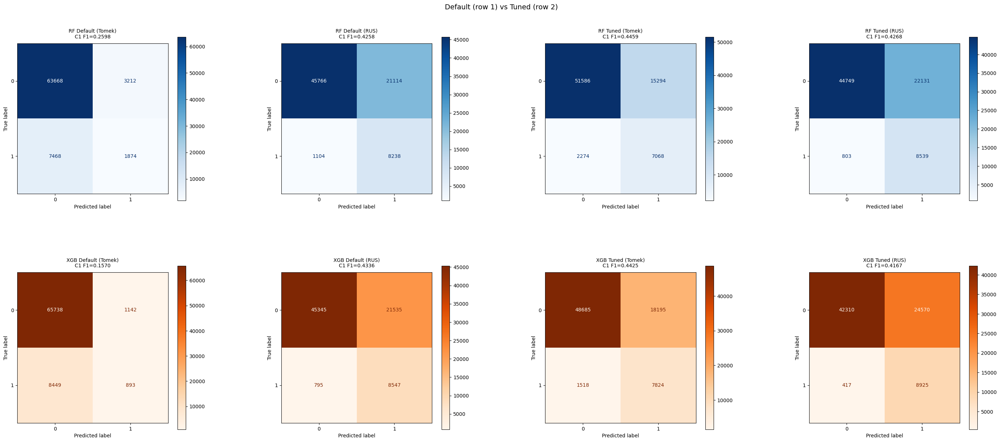
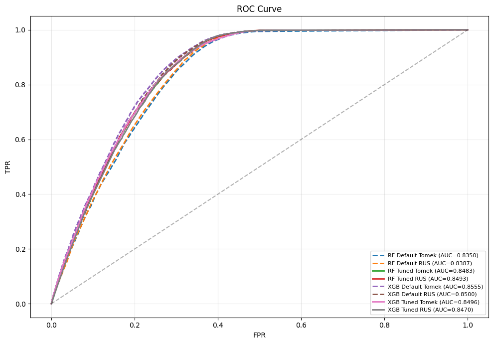
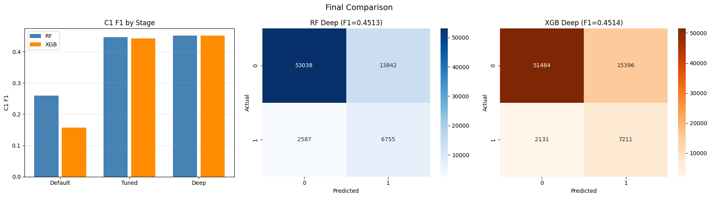
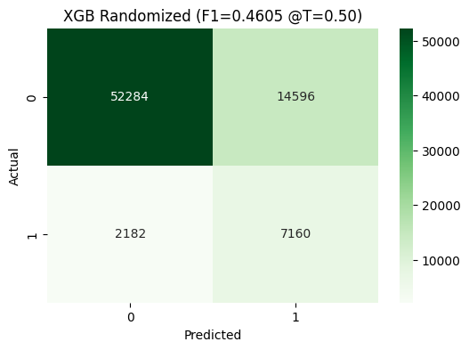
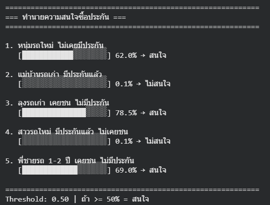

# Health Insurance Cross Sell Prediction


## ภาพรวมโครงการ (Project Overview)
โครงการนี้มีวัตถุประสงค์เพื่อดำเนินการวิเคราะห์ข้อมูลเชิงสำรวจ (Exploratory Data Analysis: EDA) บนชุดข้อมูลลูกค้าประกันภัย เพื่อทำความเข้าใจลักษณะการกระจายของข้อมูล ความสัมพันธ์ระหว่างตัวแปร และปัจจัยที่ส่งผลต่อการตอบสนองของลูกค้า (Response)
โดยผลลัพธ์จากการทำ EDA จะถูกนำไปใช้ในการคัดเลือกตัวแปร (Feature Selection) และออกแบบตัวแปรใหม่ (Feature Engineering) เพื่อเตรียมความพร้อมสำหรับการพัฒนาแบบจำลองการเรียนรู้ของเครื่องประเภท Ensemble ซึ่งมุ่งเน้นการเพิ่มประสิทธิภาพ
ในการพยากรณ์และลดความเอนเอียงของโมเดล

---

## นิยามปัญหา (Problem Statement)
แม้ว่าชุดข้อมูลจะมีตัวแปรที่หลากหลายซึ่งครอบคลุมลักษณะของลูกค้าและยานพาหนะ แต่ยังขาดความเข้าใจอย่างเป็นระบบเกี่ยวกับความสัมพันธ์ระหว่างตัวแปรอิสระกับตัวแปรเป้าหมาย (`Response`)
ปัญหาที่พบในข้อมูลชุดนี้ ได้แก่:
- ตัวแปรเป้าหมายมีลักษณะไม่สมดุล (Class Imbalance)
- ตัวแปรบางส่วนเป็นข้อมูลเชิงหมวดหมู่ที่ถูกเข้ารหัสเป็นตัวเลข ซึ่งอาจนำไปสู่การตีความที่คลาดเคลื่อน
- ยังไม่สามารถระบุได้อย่างชัดเจนว่าตัวแปรใดมีอิทธิพลต่อการตอบสนองของลูกค้า
- การเลือกตัวแปรแบบสุ่มอาจส่งผลต่อประสิทธิภาพของแบบจำลองในขั้นตอนถัดไป

---

## วัตถุประสงค์ของโครงการ (Objectives)
1. เพื่อสำรวจโครงสร้างและลักษณะการกระจายของข้อมูลในแต่ละตัวแปร
2. เพื่อวิเคราะห์ความสัมพันธ์ระหว่างตัวแปรอิสระกับตัวแปรเป้าหมาย (Response)
3. เพื่อค้นหาตัวแปรที่มีความสำคัญต่อการพยากรณ์
4. เพื่อสนับสนุนการคัดเลือกตัวแปร (Feature Selection) อย่างมีเหตุผลเชิงข้อมูล
5. เพื่อเตรียมชุดข้อมูลสำหรับการสร้างแบบจำลอง Machine Learning ประเภท Ensemble เช่น  
   - Random Forest  
   - XGBoost  

---

## รายละเอียดชุดข้อมูล (Dataset Description)
- ชุดข้อมูลเป็นข้อมูลระดับลูกค้า โดย 1 แถวแทนลูกค้า 1 ราย และแต่ละคอลัมน์แทนคุณลักษณะของลูกค้า
- จำนวนข้อมูล: 381,109 แถว
- จำนวนตัวแปร: 12 ตัวแปร
- Data Sources [www.kaggle.com](https://www.kaggle.com/datasets/anmolkumar/health-insurance-cross-sell-prediction/code)

---

## Data Dictionary
| ชื่อตัวแปร | ประเภทข้อมูล | คำอธิบาย |
|----------|------------|----------|
| `id` | Integer | รหัสประจำตัวลูกค้า (Unique ID) |
| `Gender` | Categorical | เพศของลูกค้า (Male, Female) |
| `Age` | Numeric | อายุของลูกค้า (ปี) |
| `Driving_License` | Binary | สถานะการมีใบขับขี่ (1 = มีใบขับขี่, 0 = ไม่มีใบขับขี่) |
| `Region_Code` | Categorical (Encoded) | รหัสระบุภูมิภาคของลูกค้า (ถูกเข้ารหัส) |
| `Previously_Insured` | Binary | สถานะการเคยมีประกันรถยนต์มาก่อน (1 = เคยมี, 0 = ไม่เคยมี) |
| `Vehicle_Age` | Categorical | อายุของรถยนต์ (< 1 Year, 1-2 Year, > 2 Years) |
| `Vehicle_Damage` | Categorical | ประวัติรถเคยเกิดความเสียหาย (Yes = เคยเกิดความเสียหาย, No = ไม่เคย) |
| `Annual_Premium` | Numeric | จำนวนเงินค่าเบี้ยประกันที่ลูกค้าต้องชำระต่อปี |
| `Policy_Sales_Channel` | Categorical (Encoded) | รหัสช่องทางการขายแบบไม่ระบุตัวตน เช่น ตัวแทนขาย, โทรศัพท์, จดหมาย, พบลูกค้าโดยตรง |
| `Vintage` | Numeric | จำนวนวันตั้งแต่ลูกค้าเริ่มมีความสัมพันธ์กับบริษัท |
| `Response` | Binary (Target) | ตัวแปรเป้าหมาย แสดงความสนใจของลูกค้า (1 = สนใจ / ตอบรับ, 0 = ไม่สนใจ) |

---

## เครื่องมือและไลบรารี (Tools & Libraries)
- **Python**: ภาษาหลักสำหรับการวิเคราะห์ข้อมูลและการสร้างโมเดล
- **Pandas / NumPy**: การจัดการและประมวลผลข้อมูล
- **Matplotlib / Seaborn**: การสร้างกราฟและการแสดงผลข้อมูล
- **Scikit-learn**: เครื่องมือสำหรับ preprocessing, feature selection และ ensemble models
- **XGBoost**: Ensemble learning library สำหรับ Gradient Boosting

---

## Exploratory Data Analysis (EDA)
- ชุดข้อมูลที่ใช้ในการวิเคราะห์ประกอบด้วยข้อมูลลูกค้า 381,109 ราย โดยมีตัวแปรทั้งหมด 12 ตัวแปร 
- ข้อมูลทั้งหมดไม่มีค่า missing values 
- ตัวแปรเป้าหมาย (Response) มี Class Imbalance โดย
  - กลุ่มที่ไม่ตอบรับ (Response = 0) มีสัดส่วน 87.74% 
  - กลุ่มที่ตอบรับ (Response = 1) มีเพียง 12.26%
- ตัวแปรในชุดข้อมูลสามารถแบ่งออกเป็น 3 ประเภทหลัก ได้แก่
  - ตัวแปรเชิงหมวดหมู่ (Categorical Variables) Gender/Vehicle_Age/Vehicle_Damage
  - ตัวแปรแบบไบนารี (Binary Variables) Previously_Insured/Driving_License
  - ตัวแปรเชิงตัวเลข (Numerical Variables) Age/Annual_Premium/Vintage
  - ตัวแปรรหัสเชิงระเบียน (Categorical (Encoded)) Region_Code/Policy_Sales_Channel


---

### กลุ่มที่ 1: Categorical (เชิงคุณลักษณะ) vs Response
จากการวิเคราะห์ความสัมพันธ์แบบสองตัวแปร ระหว่างตัวแปรเชิงหมวดหมู่กับตัวแปรเป้าหมาย (Response) โดยพิจารณาอัตราการตอบรับ (Response Rate) พบประเด็นสำคัญดังนี้


**Gender**
- พบอัตราการตอบรับแตกต่างกันเล็กน้อยระหว่างแต่ละค่า
- อย่างไรก็ตาม ความแตกต่างไม่ชัดเจน และเมื่อพิจารณาร่วมกับตัวแปรอื่น พบว่าให้สัญญาณเชิงทำนายค่อนข้างจำกัด

**Vehicle_Age**
- ลูกค้าที่มีรถอายุมากกว่ามีอัตราการตอบรับสูงกว่าอย่างชัดเจน
- สะท้อนว่าลูกค้าที่ใช้รถมานานมีแรงจูงใจในการทำประกันรถมากกว่า

**Vehicle_Damage**
- ลูกค้าที่มีประวัติรถเสียหายมีอัตราการตอบรับสูงกว่ามากเมื่อเทียบกับลูกค้าที่ไม่เคยมีความเสียหาย
- ตัวแปรนี้แสดงความสัมพันธ์เชิงธุรกิจกับการรับรู้ความเสี่ยงและความต้องการทำประกันรถ

---

### กลุ่มที่ 2: Binary (เชิงพฤติกรรมลูกค้า) vs Response
จากการวิเคราะห์ความสัมพันธ์แบบสองตัวแปร ระหว่างตัวแปรเชิงหมวดหมู่กับตัวแปรเป้าหมาย (Response) โดยพิจารณาอัตราการตอบรับ (Response Rate) พบประเด็นสำคัญดังนี้


**Previously_Insured**
- ลูกค้าที่ไม่เคยมีประกันรถมีอัตราการตอบรับสูงอย่างชัดเจน
- ลูกค้าที่มีประกันรถอยู่แล้วแทบไม่แสดงความสนใจซื้อเพิ่มเติม
- เป็นตัวแปรเชิงพฤติกรรมที่มีอิทธิพลต่อ Response สูงที่สุด

**Driving_License**
- ลูกค้าที่มีใบขับขี่มีอัตราการตอบรับสูงกว่ากลุ่มที่ไม่มีใบขับขี่
- อย่างไรก็ตาม ความแตกต่างไม่เด่นชัดมากเมื่อเทียบกับ Previously_Insured
- ให้สัญญาณเชิงทำนายระดับรอง

---

### กลุ่มที่ 3: Numerical Variables vs Response
จากการวิเคราะห์เชิงสองตัวแปร โดยพิจารณาความสัมพันธ์ระหว่างตัวแปรเชิงตัวเลข (Numerical Variables) กับตัวแปรเป้าหมาย (Response) ผ่านการเปรียบเทียบการกระจายของข้อมูลด้วย
boxplot พบว่าตัวแปรแต่ละตัวแสดงรูปแบบความสัมพันธ์กับการตอบสนองของลูกค้าที่แตกต่างกัน ดังนี้


### กลุ่มที่ 3: Numerical Variables vs Response

**Age**
- กลุ่มลูกค้าที่สนใจซื้อมีค่าอายุมัธยฐานสูงกว่ากลุ่มไม่สนใจเล็กน้อย
- แสดงแนวโน้มว่าลูกค้าวัยกลางมีความสนใจมากกว่าวัยต่ำมาก

**Annual_Premium**
- การกระจายของข้อมูลมีความเบ้ขวาและมี outliers จำนวนมาก
- กลุ่มที่สนใจมีค่าเบี้ยกระจุกในช่วงระดับกลางถึงสูง
- ตัวแปรนี้เหมาะสำหรับใช้ร่วมกับการ transform หรือการวิเคราะห์ร่วมกับตัวแปรอื่น

**Vintage**
- ไม่พบความแตกต่างที่ชัดเจนระหว่างกลุ่ม Response
- เป็นตัวแปรเสริมที่อาจช่วยเพิ่มบริบทเชิงพฤติกรรม แต่ไม่ใช่ตัวแปรหลัก

---

### กลุ่มที่ 4: Categorical (Encoded) vs Response
อัตราการตอบสนอง (Response Rate %) ของลูกค้า โดยจัดเรียงจาก ค่าสูงไปต่ำ สำหรับตัวแปรที่มีลักษณะเป็น high-cardinality categorical variables ได้แก่ Region_Code และ Policy_Sales_Channel ซึ่งมีจำนวนกลุ่มย่อยจำนวนมาก 
การแสดงผลในลักษณะนี้มีวัตถุประสงค์เพื่อให้เห็นภาพรวมของความแตกต่างเชิงรูปแบบ (pattern) มากกว่าการตีความเชิงลำดับหรือเชิงสาเหตุ


### กลุ่มที่ 4: Categorical (Encoded) Variables vs Response

**Region_Code**
- พบความแตกต่างของอัตราการตอบรับระหว่างบาง Region
- อย่างไรก็ตาม ไม่ปรากฏ pattern เชิงธุรกิจที่สอดคล้องชัดเจน
- เหมาะสำหรับใช้เป็นตัวแปรเสริมในการเพิ่มความสามารถในการแยกกลุ่มของโมเดล

**Policy_Sales_Channel**
- ช่องทางการขายบางประเภทมีอัตราการตอบรับสูงกว่าช่องทางอื่น
- แสดงอิทธิพลเชิงพฤติกรรมและวิธีการเข้าถึงลูกค้า
- เป็นตัวแปรที่ช่วยเพิ่มความสามารถในการทำนายของโมเดล

---

## Feature Selection Prioritization
จากผลการวิเคราะห์ EDA และการทดลอง Feature Selection แบบตัดตัวแปรตามลำดับความสำคัญ
สามารถจัดกลุ่มตัวแปรได้ดังนี้

### High-Priority Features (ตัวแปรสำคัญมาก)
ตัวแปรกลุ่มนี้ให้สัญญาณแรงและมีผลต่อประสิทธิภาพของโมเดลโดยตรง

- Previously_Insured  
- Vehicle_Damage  
- Vehicle_Age  

### Medium-Priority Features (ช่วยเพิ่มความคมของโมเดล)
ตัวแปรกลุ่มนี้ช่วยเพิ่มความสามารถในการแยกคลาสและลด False Positive

- Policy_Sales_Channel  
- Region_Code  
- Annual_Premium  
- Vintage  
- (Age – ใช้เป็นตัวแปรเสริมได้ ขึ้นกับโมเดล)

### Low-Priority / Optional Features
ตัวแปรที่ตัดออกแล้วไม่ส่งผลต่อประสิทธิภาพของโมเดลอย่างมีนัยสำคัญ

- Gender  
- Driving_License  
- id (เป็นเพียงตัวระบุข้อมูล)

**Recommended Feature Set**
- Previously_Insured  
- Vehicle_Damage  
- Vehicle_Age  
- Policy_Sales_Channel  
- Region_Code  
- Annual_Premium  
- Vintage  
- Age

--- 

## Modeling Methodology
### 🖥️ Model Type
 - **Supervised Learning:** ประเภท Binary Classification
 - **Target Label:** กลุ่มที่ไม่ตอบรับ (0) และ กลุ่มที่ตอบรับ (Response = 1)
 - **Features:** Previously_Insured, Vehicle_Damage, Vehicle_Age, Policy_Sales_Channel, Region_Code, Age, Annual_Premium, Vintage
 - **Optional Features:** Driving_License, Gender

### ⚙️ Chosen Model
 - **XGBoost**
 - **Random Forest**

---

## Step 1: เขียน Pipeline Encode → Feature Engineering → Scale → Sampling → Model
Pipeline นี้ถูกออกแบบเพื่อป้องกันปัญหา **data leakage** และทำให้ทุกขั้นตอนที่ต้องเรียนรู้จากข้อมูล ถูก fit เฉพาะบนชุดข้อมูลฝึก (training set) เท่านั้น โดยมีลำดับขั้นตอนดังนี้

### 1.1 Encoding
แปลงตัวแปรเชิงหมวดหมู่ให้อยู่ในรูปแบบตัวเลขที่โมเดลสามารถเรียนรู้ได้ โดยใช้ One-Hot Encoding และ Ordinal Encoding

### 1.2 Feature Engineering
สร้างตัวแปรใหม่เพื่อสะท้อนพฤติกรรมและความเสี่ยงของลูกค้าได้ดีกว่าการใช้ตัวแปรดั้งเดิม
- `Age_x_Vehicle` ใช้สะท้อนผลกระทบร่วมระหว่างอายุลูกค้าและอายุการใช้งานรถ
- `Premium_per_Vintage` ใช้วัดความเข้มข้นของการจ่ายเบี้ยเมื่อเทียบกับระยะเวลาที่เป็นลูกค้า

### 1.3 Scaling
ปรับขนาดค่าตัวแปรเชิงตัวเลขให้อยู่ในช่วงเดียวกัน เพื่อลดอิทธิพลของค่าที่มีสเกลสูง และช่วยให้การเรียนรู้ของโมเดลมีเสถียรภาพมากขึ้น

### 1.4 Sampling
จัดการปัญหา class imbalance โดยใช้วิธีการสุ่มตัวอย่างข้อมูล เช่น RandomUnderSampler ซึ่งจะถูกดำเนินการภายใน pipeline และถูก fit เฉพาะบนชุดข้อมูลฝึก (training set) เท่านั้น เพื่อป้องกันปัญหา data leakage

### 1.5 Model
แบบจำลอง Machine Learning เช่น Random Forest ในค่าเริ่มต้น (default configuration) โดยยังไม่มีการปรับแต่ง hyperparameters ในขั้นตอนนี้


**Code:**
```python
from sklearn.preprocessing import OrdinalEncoder, OneHotEncoder
from sklearn.compose import ColumnTransformer
df = df.set_index('id')
X = df.drop(columns=['Response'])
y = df['Response']
# === Preprocessing: ColumnTransformer ===
preprocessor = ColumnTransformer([
    ('onehot',  OneHotEncoder(drop='first', sparse_output=False), ['Gender']),
    ('ordinal', OrdinalEncoder(categories=[['< 1 Year', '1-2 Year', '> 2 Years']]), ['Vehicle_Age']),
    ('binary',  OrdinalEncoder(categories=[['No', 'Yes']]), ['Vehicle_Damage']),
    ('numeric', StandardScaler(), ['Age', 'Region_Code', 'Previously_Insured',
                                    'Annual_Premium', 'Policy_Sales_Channel', 'Vintage']),], remainder='drop')
# Feature Engineering
def add_features(X):
    import pandas as pd
    cols = ['Gender_Male', 'Vehicle_Age', 'Vehicle_Damage',
            'Age', 'Region_Code', 'Previously_Insured',
            'Annual_Premium', 'Policy_Sales_Channel', 'Vintage']
    X = pd.DataFrame(X, columns=cols)
    X['Age_x_Vehicle'] = X['Age'] * X['Vehicle_Age']
    X['Premium_per_Vintage'] = X['Annual_Premium'] / (X['Vintage'] + 1)
    return X
# === Full Pipeline ===
def make_full_pipeline(model, sampler=None):
    steps = [
        ('preprocess',  preprocessor),
        ('feature_eng', FunctionTransformer(add_features)),
        ('scale2',      StandardScaler()),    ]
    if sampler is not None:
        steps.append(('sampling', sampler))
    steps.append(('model', model))
    return Pipeline(steps=steps)
```
---

## ✂️ Step 2: Train/Test Split

**Code:**
```python
X_train, X_test, y_train, y_test = train_test_split(
    X, y, test_size=0.2, random_state=42, stratify=y)
```
**Train:** 304,887
**Test:** 76,222

---

## Step 3: Training Model

### 3.1 Function: train_default()

ใช้สำหรับฝึกโมเดลด้วย pipeline เต็มรูปแบบ โดยไม่ใช้ GridSearchCV สำหรับการทดลองโมเดล baseline

**Code:**
```python
skf = StratifiedKFold(n_splits=5, shuffle=True, random_state=42)

def train_default(model, sampler, X_tr, y_tr, X_te, y_te, name):
    pipe = make_full_pipeline(model, sampler=sampler)
    pipe.fit(X_tr, y_tr)

    y_pred = pipe.predict(X_te)
    y_proba = pipe.predict_proba(X_te)[:, 1]
    report = classification_report(y_te, y_pred, output_dict=True)

    r = {
        'best_params': 'Default', 'cv_f1': '-',
        'c0_precision': report['0']['precision'], 'c0_recall': report['0']['recall'], 'c0_f1': report['0']['f1-score'],
        'c1_precision': report['1']['precision'], 'c1_recall': report['1']['recall'], 'c1_f1': report['1']['f1-score'],
        'accuracy': accuracy_score(y_te, y_pred), 'roc_auc': roc_auc_score(y_te, y_proba),
        'y_pred': y_pred, 'y_proba': y_proba, 'model': pipe, 'scaler': None,
        'precision': precision_score(y_te, y_pred), 'recall': recall_score(y_te, y_pred), 'f1': f1_score(y_te, y_pred),
        'pipeline': pipe,
    }
    print(f'{name:<35} Class1: P={r["c1_precision"]:.4f} R={r["c1_recall"]:.4f} F1={r["c1_f1"]:.4f} | AUC={r["roc_auc"]:.4f}')
    return r
```
---

### 3.2 การเปรียบเทียบ RandomUnderSampler และ TomekLinks โดยใช้ Random Forest และ XGBoost (Default Setting)

ในขั้นตอนนี้ มีวัตถุประสงค์เพื่อเปรียบเทียบประสิทธิภาพของวิธีการจัดการ class imbalance ระหว่าง **RandomUnderSampler (RUS)** และ **Tomek Links** โดยใช้โมเดล Random Forest และ XGBoost ในค่า default configuration เพื่อประเมินผลกระทบของวิธี sampling ต่อโมเดลโดยยังไม่ปรับแต่งพารามิเตอร์ใด ๆ

**Code:**
```python
rf_default_tl  = train_default(RandomForestClassifier(random_state=42, n_jobs=-1),
                               TomekLinks(), X_train, y_train, X_test, y_test, 'RF Default (Tomek)')
rf_default_rus = train_default(RandomForestClassifier(random_state=42, n_jobs=-1),
                               RandomUnderSampler(random_state=42), X_train, y_train, X_test, y_test, 'RF Default (RUS)')
xgb_default_tl  = train_default(XGBClassifier(device='cuda', random_state=42, eval_metric='logloss'),
                                TomekLinks(), X_train, y_train, X_test, y_test, 'XGB Default (Tomek)')
xgb_default_rus = train_default(XGBClassifier(device='cuda', random_state=42, eval_metric='logloss'),
                                RandomUnderSampler(random_state=42), X_train, y_train, X_test, y_test, 'XGB Default (RUS)')
```
### ผลการเปรียบเทียบ RandomUnderSampler และ Tomek Links (Default Model)

| Model | Sampling Method | Precision (Class 1) | Recall (Class 1) | F1-score (Class 1) | AUC |
|------|-----------------|---------------------|------------------|--------------------|-----|
| Random Forest | Tomek Links | **0.3685** | 0.2006 | 0.2598 | 0.8350 |
| Random Forest | Random Under Sampler | 0.2807 | **0.8818** | 0.4258 | 0.8387 |
| XGBoost (GPU) | Tomek Links | **0.4388** | 0.0956 | 0.1570 | 0.8555 |
| XGBoost (GPU) | Random Under Sampler | 0.2841 | **0.9149** | 0.4336 | 0.8500 |

### สรุปผลการเปรียบเทียบ

จากผลการทดลองพบว่า RandomUnderSampler ให้ค่า Recall ของคลาสเป้าหมายสูงมาก ทั้งใน Random Forest (0.8818) และ XGBoost (0.9149) แต่แลกมาด้วย Precision ที่ลดลงอย่างชัดเจน
ในขณะที่ Tomek Links ให้ Precision สูงกว่า แต่ไม่สามารถจับกลุ่มลูกค้าที่สนใจได้ดี เมื่อใช้ค่า default ของโมเดล

---

### 3.3 การปรับแต่งพารามิเตอร์ของ Random Forest ร่วมกับวิธี Sampling

จากผลการทดลองในขั้นตอนก่อนหน้า พบว่าการใช้วิธี Sampling แบบต่าง ๆ (RandomUnderSampler และ Tomek Links) กับโมเดลค่าเริ่มต้น (Default) ยังไม่สามารถสรุปได้อย่างชัดเจนว่าวิธีใดให้ผลลัพธ์ที่เหมาะสมที่สุด
เนื่องจากแต่ละวิธีมี trade-off ระหว่าง Precision และ Recall ที่แตกต่างกัน ดังนั้น ในขั้นตอนนี้จึงได้ทำการปรับแต่งพารามิเตอร์ (Hyperparameter Tuning) ของโมเดล Random Forest ควบคู่ไปกับการเลือกวิธี Sampling
เพื่อประเมินว่าการปรับความซับซ้อนของโมเดล สามารถช่วยดึงศักยภาพของวิธี Sampling แต่ละแบบออกมาได้มากขึ้นหรือไม่

### ผลการปรับแต่ง Random Forest ร่วมกับวิธี Sampling

| Sampling Method | Config | n_estimators | max_depth | class_weight | Precision (C1) | Recall (C1) | F1-score (C1) | AUC |
|----------------|--------|--------------|-----------|--------------|----------------|--------------|----------------|-----|
| Tomek Links | 1 | 100 | 10 | None | 0.2535 | 0.0883 | 0.1306 | 0.8151 |
| Tomek Links | 2 | 200 | 30 | balanced | 0.3160 | 0.7546 | 0.4457 | 0.8480 |
| 🏆 **Tomek Links (Best)** | **3** | **300** | **20** | **balanced** | **0.3161** | **0.7566** | **⭐ 0.4459** | **0.8483** |
| Tomek Links | 4 | 300 | 25 | balanced | 0.3645 | 0.1739 | 0.2355 | 0.8362 |
| Random Under Sampler | 1 | 100 | 10 | None | 0.2759 | 0.9376 | 0.4264 | 0.8560 |
| Random Under Sampler | 2 | 200 | 30 | balanced | 0.2780 | 0.9138 | 0.4263 | 0.8491 |
| ✅ **RUS (Best)** | **3** | **300** | **20** | **balanced** | **0.2784** | **0.9140** | **0.4268** | **0.8490** |
| Random Under Sampler | 4 | 300 | 25 | balanced | 0.2797 | 0.8862 | 0.4252 | 0.8397 |

### สรุปผลการเปรียบเทียบ
จากการปรับแต่งพารามิเตอร์ของ Random Forest พบว่า Tomek Links ให้ค่า F1-score ของคลาสเป้าหมายสูงที่สุด (0.4459) ขณะที่ RandomUnderSampler ให้ Recall สูงกว่าแต่มี Precision ต่ำกว่า
ผลลัพธ์ดังกล่าวแสดงให้เห็นว่า Tomek Links มีความเหมาะสมมากกว่า เมื่อพิจารณาสมดุลระหว่าง Precision และ Recall จึงถูกเลือกเป็นวิธี Sampling หลักสำหรับขั้นตอนถัดไป

---

### 3.4 การปรับแต่งพารามิเตอร์ของ XGBoost ร่วมกับวิธี Sampling
การทดลองในขั้นตอนนี้ใช้ GridSearchCV เพื่อค้นหาค่าพารามิเตอร์ที่เหมาะสมของ XGBoost โดยทำการทดสอบร่วมกับวิธี Sampling (RandomUnderSampler และ Tomek Links) ในลักษณะของการทดลองแยกกันในแต่ละกรณี เพื่อประเมินผลกระทบของวิธี Sampling ต่อประสิทธิภาพของโมเดล

**Code:**
```python
xgb_param = {
    'n_estimators': [100, 200, 300],
    'max_depth': [3, 6, 10],
    'learning_rate': [0.01, 0.1, 0.3],
    'scale_pos_weight': [1, 7],
}
total = np.prod([len(v) for v in xgb_param.values()])
print(f'XGB: {total} combos × 5 folds = {total*5} fits (GPU)')

def xgb_grid_gpu(X_tr, y_tr, params, sampler, name):
    grid = GridSearchCV(
        XGBClassifier(device='cuda', random_state=42, eval_metric='logloss'),
        params, cv=skf, scoring='f1', n_jobs=1, refit=True
    )
    grid.fit(X_tr, y_tr)

    y_pred  = grid.predict(X_test_pre)
    y_proba = grid.predict_proba(X_test_pre)[:, 1]
    report  = classification_report(y_test, y_pred, output_dict=True)
    bp = grid.best_params_

    full_pipe = make_full_pipeline(
        XGBClassifier(**bp, device='cuda', random_state=42, eval_metric='logloss'),
        sampler=sampler
    )
    full_pipe.fit(X_train, y_train)

    r = {
        'best_params': bp, 'cv_f1': f'{grid.best_score_:.4f}',
        'c0_precision': report['0']['precision'], 'c0_recall': report['0']['recall'], 'c0_f1': report['0']['f1-score'],
        'c1_precision': report['1']['precision'], 'c1_recall': report['1']['recall'], 'c1_f1': report['1']['f1-score'],
        'accuracy': accuracy_score(y_test, y_pred), 'roc_auc': roc_auc_score(y_test, y_proba),
        'y_pred': y_pred, 'y_proba': y_proba, 'model': full_pipe, 'scaler': None,
        'precision': precision_score(y_test, y_pred), 'recall': recall_score(y_test, y_pred), 'f1': f1_score(y_test, y_pred),
        'pipeline': full_pipe,
    }
    print(f'{name:<35} CV F1={grid.best_score_:.4f} | C1: P={r["c1_precision"]:.4f} R={r["c1_recall"]:.4f} F1={r["c1_f1"]:.4f} | AUC={r["roc_auc"]:.4f}')
    print(f'{"":35} Params: {bp}')
    return r

print('\n=== Tomek Links ===')
xgb_tuned_tl = xgb_grid_gpu(X_tl, y_tl, xgb_param, TomekLinks(), 'XGB Tuned (Tomek)')

print('\n=== RUS ===')
xgb_tuned_rus = xgb_grid_gpu(X_rus, y_rus, xgb_param, RandomUnderSampler(random_state=42), 'XGB Tuned (RUS)')
```

### ผลการปรับแต่ง XGBoost ร่วมกับวิธี Sampling

| Sampling Method | CV F1-score | Precision (Class 1) | Recall (Class 1) | F1-score (Class 1) | AUC | Best Parameters |
|-----------------|------------|----------------------|------------------|--------------------|-----|----------------|
| 🏆 **Tomek Links (Best)** | **0.4847** | 0.3007 | 0.8375 | **0.4425** | 0.8496 | learning_rate=0.1, max_depth=10, n_estimators=300, scale_pos_weight=7 |
| Random Under Sampler | 0.8216 | 0.2665 | **0.9554** | 0.4167 | 0.8470 | learning_rate=0.01, max_depth=3, n_estimators=300, scale_pos_weight=1 |

### สรุปผลการเปรียบเทียบ

จากผลการปรับแต่งพารามิเตอร์ของ XGBoost พบว่า การใช้ Tomek Links ให้ผลลัพธ์ที่สมดุลระหว่าง Precision และ Recall มากกว่า โดยมีค่า F1-score ของคลาสเป้าหมายสูงที่สุด (0.4425)
แม้ว่า RandomUnderSampler จะให้ค่า Recall สูงกว่าอย่างชัดเจน แต่แลกมาด้วย Precision ที่ลดลง ส่งผลให้ F1-score โดยรวมต่ำกว่า 

ผลลัพธ์นี้สะท้อนว่า Tomek Links สามารถลด noise ของข้อมูลและช่วยให้ XGBoost เรียนรู้ decision boundary ได้มีประสิทธิภาพมากกว่า จึงถูกเลือกเป็นวิธี Sampling ที่เหมาะสมสำหรับ XGBoost ในขั้นตอนการคัดเลือกโมเดลสุดท้าย

---

## Step 4: Model Evaluation

ในขั้นตอนนี้ ได้ทำการประเมินประสิทธิภาพของโมเดลทั้งหมดที่ได้จากการทดลองก่อนหน้า โดยพิจารณาจากตัวชี้วัดหลายมิติ ได้แก่ Confusion Matrix, ROC Curve และค่า AUC รวมถึง metric ของคลาสเป้าหมาย
เพื่อวิเคราะห์ trade-off ระหว่าง Precision และ Recall ก่อนนำไปสู่การตัดสินใจเลือกโมเดลสุดท้าย

### 4.1 ตารางเปรียบเทียบโมเดล

| Model | Sampling | CV F1 | C1 Precision | C1 Recall | **C1 F1** | AUC |
|------|----------|-------|--------------|-----------|-----------|-----|
| 🏆 **RF Tuned** | **Tomek Links** | – | **0.3161** | **0.7566** | ⭐ **0.4459** ⭐ | 0.8483 |
| XGB Tuned | Tomek Links | 0.4847 | 0.3007 | 0.8375 | 0.4425 | **0.8496** |
| XGB Default | Random Under | – | 0.2841 | 0.9149 | 0.4336 | **0.8500** |
| RF Tuned | Random Under | – | 0.2784 | 0.9140 | 0.4268 | 0.8493 |
| RF Default | Random Under | – | 0.2807 | 0.8818 | 0.4258 | 0.8387 |
| XGB Tuned | Random Under | 0.8216 | 0.2665 | **0.9554** | 0.4167 | 0.8470 |
| RF Default | Tomek Links | – | 0.3685 | 0.2006 | 0.2598 | 0.8350 |
| XGB Default | Tomek Links | – | **0.4388** | 0.0956 | 0.1570 | **0.8555** |

### 4.2 Confusion Matrix



### 4.3 ROC Curve



จากการประเมินด้วยกราฟ ROC พบว่าโมเดลที่ผ่านการปรับแต่งพารามิเตอร์ ทั้ง Random Forest และ XGBoost ให้ค่า AUC อยู่ในระดับใกล้เคียงกัน แสดงให้เห็นถึงความสามารถในการแยกคลาสโดยรวมที่ดี
อย่างไรก็ตาม การวิเคราะห์ Confusion Matrix แสดงให้เห็นความแตกต่างเชิงพฤติกรรมของโมเดล โดยโมเดลที่ใช้ Tomek Links ให้ความสมดุลระหว่าง Precision และ Recall ของคลาสเป้าหมายมากกว่า ขณะที่ Random Under Sampling แม้จะให้ Recall สูง
แต่มีแนวโน้มสร้าง false positive ในสัดส่วนที่มากกว่า

---

## Step 5: Deep Tuning

จากขั้นตอนการประเมินโมเดลก่อนหน้าจะพบว่า โมเดลบางชุดเริ่มแสดงศักยภาพที่เหนือกว่าโมเดลอื่น แต่ยังไม่สามารถสรุปผลการเลือกแบบจำลองสุดท้ายได้อย่างชัดเจน เนื่องจากค่า performance ของหลายโมเดลยังอยู่ในช่วงใกล้เคียงกัน
ดังนั้น ในขั้นตอนนี้จึงได้ดำเนินการปรับแต่งพารามิเตอร์เชิงลึก (Deep Tuning) กับโมเดลที่มีศักยภาพสูง โดยมุ่งเน้นการปรับความซับซ้อนของโมเดล และพิจารณา trade-off ระหว่าง Precision และ Recall ของคลาสเป้าหมายอย่างละเอียด
เพื่อดึงประสิทธิภาพสูงสุดของแต่ละโมเดลออกมาก่อนทำการตัดสินใจเลือกแบบจำลองสุดท้าย

### 5.1 Random Forest Deep Tuning - 13 Configs

**Code:**
```python
old = rf_tuned_tl['best_params']
print(f'Params เดิม: {old}')
print(f'C1 F1 เดิม: {rf_tuned_tl["c1_f1"]:.4f}\n')
d = old.get('max_depth', 10)
n = old.get('n_estimators', 300)
rf_configs = [
    {**old},
    {**old, 'n_estimators': n + 200},
    {**old, 'n_estimators': n + 400},
    {**old, 'max_depth': d - 2 if d and d > 3 else d},
    {**old, 'max_depth': d + 5 if d else 15},
    {**old, 'min_samples_split': 5},
    {**old, 'min_samples_split': 10},
    {**old, 'min_samples_leaf': 3},
    {**old, 'min_samples_leaf': 5},
    {**old, 'max_features': 'sqrt'},
    {**old, 'max_features': 0.7},
    {**old, 'n_estimators': n + 200, 'min_samples_split': 5, 'min_samples_leaf': 3},
    {**old, 'n_estimators': n + 200, 'max_features': 'sqrt', 'min_samples_leaf': 3},
]

rf_rows = []
for i, params in enumerate(rf_configs, 1):
    pipe = make_full_pipeline(RandomForestClassifier(**params, random_state=42, n_jobs=-1), sampler=TomekLinks())
    pipe.fit(X_train, y_train)
    y_proba = pipe.predict_proba(X_test)[:, 1]

    f1s_t = [f1_score(y_test, (y_proba >= t).astype(int)) for t in np.arange(0.3, 0.7, 0.05)]
    best_t = np.arange(0.3, 0.7, 0.05)[np.argmax(f1s_t)]
    rpt = classification_report(y_test, (y_proba >= best_t).astype(int), output_dict=True)

    rf_rows.append({'Config': i, 'C1 Prec': round(rpt['1']['precision'], 4),
        'C1 Rec': round(rpt['1']['recall'], 4), 'C1 F1': round(rpt['1']['f1-score'], 4),
        'Threshold': best_t, 'AUC': round(roc_auc_score(y_test, y_proba), 4), 'Params': str(params)})
    print(f'Config {i:2d}: C1 F1={rpt["1"]["f1-score"]:.4f} @T={best_t:.2f} | AUC={roc_auc_score(y_test, y_proba):.4f}')

df_rf = pd.DataFrame(rf_rows).sort_values('C1 F1', ascending=False).reset_index(drop=True)
print(f'\n=== RF เรียงตาม C1 F1 ===')
df_rf[['Config','C1 Prec','C1 Rec','C1 F1','Threshold','AUC']]
```

### 5.2 XGB Deep Tuning — GridSearchCV (รอบ 2) + GPU

**Code:**
```python
old_xgb = xgb_tuned_tl['best_params']
print(f'Params เดิม: {old_xgb}')
print(f'C1 F1 เดิม: {xgb_tuned_tl["c1_f1"]:.4f}\n')

lr = old_xgb.get('learning_rate', 0.1)
md_val = old_xgb.get('max_depth', 6)
ne = old_xgb.get('n_estimators', 300)
sp = old_xgb.get('scale_pos_weight', 7)

xgb_param_v2 = {
    'n_estimators': [ne, ne + 100, ne + 200],
    'max_depth': [md_val - 1, md_val, md_val + 2] if md_val > 2 else [md_val, md_val + 2],
    'learning_rate': [lr * 0.5, lr, lr * 1.5] if lr < 0.5 else [lr],
    'scale_pos_weight': [sp - 2, sp, sp + 3] if sp > 2 else [sp, sp + 3],
    'min_child_weight': [1, 3, 5],
}
total = np.prod([len(v) for v in xgb_param_v2.values()])
print(f'Combos: {total} × 5 folds = {total*5} fits (GPU)')
print(f'ใช้ X_tl จาก Section 4.2 (preprocess + TomekLinks เรียบร้อยแล้ว)\n')

# GridSearchCV บน GPU (ใช้ข้อมูลที่ preprocess ไว้แล้ว)
grid_xgb_v2 = GridSearchCV(
    XGBClassifier(device='cuda', random_state=42, eval_metric='logloss'),
    xgb_param_v2, cv=skf, scoring='f1', n_jobs=1, refit=True
)
grid_xgb_v2.fit(X_tl, y_tl)

y_pred_xgb_deep  = grid_xgb_v2.predict(X_test_pre)
y_proba_xgb_deep = grid_xgb_v2.predict_proba(X_test_pre)[:, 1]

# Threshold tuning
thresholds_xgb = np.arange(0.3, 0.7, 0.05)
f1s_xgb = [f1_score(y_test, (y_proba_xgb_deep >= t).astype(int)) for t in thresholds_xgb]
best_t_xgb = thresholds_xgb[np.argmax(f1s_xgb)]
rpt_xgb_t = classification_report(y_test, (y_proba_xgb_deep >= best_t_xgb).astype(int), output_dict=True)

clean_params_xgb = grid_xgb_v2.best_params_
print(f'Best params: {clean_params_xgb}')
print(f'CV F1: {grid_xgb_v2.best_score_:.4f}')
print(f'\nC1 F1: {rpt_xgb_t["1"]["f1-score"]:.4f} @T={best_t_xgb:.2f}')
print(f'AUC:   {roc_auc_score(y_test, y_proba_xgb_deep):.4f}')
print(f'\nเดิม: {xgb_tuned_tl["c1_f1"]:.4f} → ใหม่: {rpt_xgb_t["1"]["f1-score"]:.4f}')

# Rebuild full pipeline
xgb_deep_pipe = make_full_pipeline(
    XGBClassifier(**clean_params_xgb, device='cuda', random_state=42, eval_metric='logloss'),
    sampler=TomekLinks()
)
xgb_deep_pipe.fit(X_train, y_train)
```

### 5.3 การเปลี่ยนแปลงของค่า F1-score (Class 1) จาก Default → Tuned → Deep

| Model | Default F1 | Tuned F1 | Deep F1 | Total Improvement |
|------|------------|----------|----------|------------------|
| RF | 0.2598 | 0.4459 | 0.4513 | **+0.1915** |
| XGB | 0.1570 | 0.4425 | ⭐**0.4514**⭐ | **+0.2944** |



จากตารางผลการพัฒนาโมเดลตาม Stage พบว่า ทั้ง Random Forest และ XGBoost มีประสิทธิภาพเพิ่มขึ้นอย่างชัดเจน เมื่อมีการปรับแต่งพารามิเตอร์เชิงลึก (Deep Tuning) โดย XGBoost ในขั้น Deep ให้ค่า F1-score ของคลาสเป้าหมายสูงที่สุด
และแสดงถึงการพัฒนาจากค่าเริ่มต้นมากที่สุด จึงถือเป็นโมเดลที่มีศักยภาพสูงสุดในขั้นตอนนี้

### 5.4 การปรับแต่ง XGBoost ด้วย RandomizedSearchCV โดยเพิ่มพารามิเตอร์ subsample และ colsample_bytree

ในขั้นตอนนี้ ได้ดำเนินการปรับแต่งพารามิเตอร์ของ XGBoost เพิ่มเติม จากการ Deep Tuning ในขั้นก่อนหน้า โดยเลือกใช้ **RandomizedSearchCV** เพื่อค้นหาชุดพารามิเตอร์ที่หลากหลายและละเอียดมากขึ้น ภายใต้ข้อจำกัดด้านเวลาและทรัพยากรการประมวลผล
ความแตกต่างสำคัญของขั้นตอนนี้คือ การเพิ่มพารามิเตอร์ **subsample** และ **colsample_bytree** ซึ่งทำหน้าที่ควบคุมสัดส่วนของข้อมูลตัวอย่างและจำนวนตัวแปร ช่วยลดการพึ่งพาข้อมูลซ้ำซ้อนและลดปัญหา overfitting รวมถึงทำให้โมเดลเรียนรู้ pattern ได้มีความหลากหลายมากขึ้น

จากผลการทดลองพบว่า การใช้ RandomizedSearchCV ร่วมกับพารามิเตอร์ดังกล่าว ช่วยเพิ่มประสิทธิภาพของ XGBoost อย่างชัดเจน โดยค่า F1-score ของคลาสเป้าหมายเพิ่มขึ้นอีกเมื่อเทียบกับผลลัพธ์จาก Deep Tuning แบบเดิม
ขณะเดียวกันยังสามารถรักษาสมดุลระหว่าง Precision และ Recall ได้ดี และมีค่า AUC เพิ่มขึ้น แสดงถึงความสามารถในการแยกคลาสที่ดีขึ้นโดยรวม

ผลลัพธ์ในขั้นตอนนี้แสดงให้เห็นว่า การควบคุม randomness ของข้อมูลและตัวแปรที่ใช้งานเป็นปัจจัยสำคัญที่ช่วยดึงศักยภาพของ XGBoost ออกมาได้สูงสุด และทำให้โมเดลมีเสถียรภาพมากขึ้น
ก่อนนำไปใช้เป็นตัวเลือกสุดท้ายในขั้นตอนถัดไป

**ทั้งหมด:** 1,152,000 combos

**RandomizedSearchCV:** สุ่ม 30 ชุด × 5 folds = 150 fits (GPU)

**Best params:** {'subsample': 0.9, 'scale_pos_weight': 3, 'reg_lambda': 1.5, 'reg_alpha': 0.1, 'n_estimators': 200, 'min_child_weight': 1, 'max_depth': 6, 'learning_rate': 0.05, 'gamma': 0.5, 'colsample_bytree': 0.8}


### 5.5 สรุปผลการประเมินโมเดล

**XGB Deep เดิม:**        C1 F1 = 0.4514
**XGB Randomized ใหม่:**  C1 F1 = 0.4605 (+0.0091)




| Class | Precision | Recall | F1-score | Support |
|-------|-----------|--------|----------|---------|
| 0 (ไม่สนใจ) | 0.96 | 0.78 | 0.86 | 66,880 |
| 1 (สนใจ) | 0.33 | 0.77 | **0.46** | 9,342 |
| **Accuracy** | – | – | **0.78** | 76,222 |
| **Macro Avg** | 0.64 | 0.77 | 0.66 | 76,222 |
| **Weighted Avg** | 0.88 | 0.78 | 0.81 | 76,222 |

---

## Step 6: Final Model Selection and Conclusion

จากผลการทดลองในขั้นตอน Deep Tuning ซึ่งรวมถึงการปรับแต่งพารามิเตอร์เชิงลึกของ Random Forest และ XGBoost รวมถึงการใช้ RandomizedSearchCV พร้อมพารามิเตอร์เพิ่มเติม
พบว่า **XGBoost (Deep Tuned)** ให้ผลการทำนายที่ดีที่สุดโดยรวม เมื่อพิจารณาจากค่า **F1-score ของคลาสเป้าหมาย (Response = 1)** เป็นหลัก

โมเดลดังกล่าวสามารถรักษาสมดุลระหว่าง Precision และ Recall ได้ดี โดยมีค่า F1-score สูงที่สุดเมื่อเทียบกับทุกเวอร์ชันของโมเดลที่ทดลอง พร้อมกับค่า AUC ที่อยู่ในระดับสูงและเสถียร
แสดงถึงความสามารถในการแยกกลุ่มลูกค้าที่มีแนวโน้มสนใจได้อย่างมีประสิทธิภาพ

ดังนั้น งานศึกษานี้จึงเลือก **XGBoost (Deep Tuned) + Tomek Links** เป็นแบบจำลองสุดท้าย สำหรับการนำไปใช้งานและพิจารณาเชิงธุรกิจในบริบทของการทำ Cross‑sell โดยเน้นการเพิ่มโอกาสในการเข้าถึงลูกค้าที่มีความสนใจ
ควบคู่กับการควบคุมต้นทุนจากการติดต่อที่ไม่จำเป็น

---

## Step 7: Model Demonstration (Prediction Demo)

ในขั้นตอนนี้ ได้ทำการสาธิตการใช้งานโมเดลที่ผ่านการคัดเลือก โดยการสร้างข้อมูลตัวอย่างของลูกค้า และนำเข้าสู่โมเดลเพื่อทำนายความน่าจะเป็นในการสนใจซื้อประกันรถ

ผลลัพธ์ของการทำนายถูกแสดงในรูปแบบของความน่าจะเป็น (probability) พร้อมทั้งกำหนด threshold ที่ 0.50 เพื่อแปลงผลลัพธ์เป็นการตัดสินใจ ว่า “สนใจ” หรือ “ไม่สนใจ”

ขั้นตอนนี้มีจุดประสงค์เพื่อแสดงให้เห็นว่าโมเดลสามารถนำไปใช้งานจริง ในการประเมินลูกค้าแต่ละรายได้อย่างไร และช่วยให้เข้าใจผลลัพธ์ของโมเดลในเชิงธุรกิจได้ชัดเจนมากขึ้น

### 7.1 ตารางตัวอย่างข้อมูลลูกค้าสำหรับการสาธิตการทำนาย (Demo Customers)

| ลำดับ | ชื่อกลุ่มลูกค้า | Gender | Age | Driving License | Region Code | Previously Insured | Vehicle Age | Vehicle Damage | Annual Premium | Policy Sales Channel | Vintage |
|------|------------------|--------|-----|-----------------|-------------|--------------------|-------------|----------------|----------------|----------------------|---------|
| 1 | หนุ่มรถใหม่ ไม่เคยมีประกัน | Male | 25 | 1 | 28 | 0 | < 1 Year | Yes | 25,000 | 26 | 200 |
| 2 | แม่บ้านรถเก่า มีประกันแล้ว | Female | 45 | 1 | 3 | 1 | > 2 Years | No | 40,000 | 152 | 60 |
| 3 | ลุงรถเก่า เคยชน ไม่มีประกัน | Male | 55 | 1 | 8 | 0 | > 2 Years | Yes | 35,000 | 26 | 100 |
| 4 | สาวรถใหม่ มีประกันแล้ว ไม่เคยชน | Female | 22 | 1 | 28 | 1 | < 1 Year | No | 20,000 | 124 | 30 |
| 5 | พี่ชายรถ 1–2 ปี เคยชน ไม่มีประกัน | Male | 40 | 1 | 11 | 0 | 1–2 Year | Yes | 45,000 | 26 | 150 |

### 7.2 ผลลัพธ์การทำนายจากโมเดล



---

😄🙏


