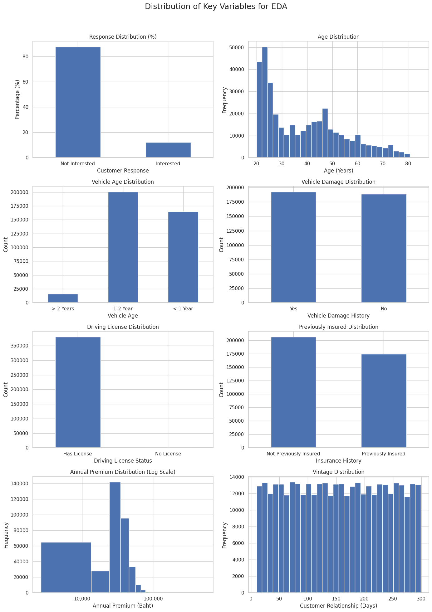
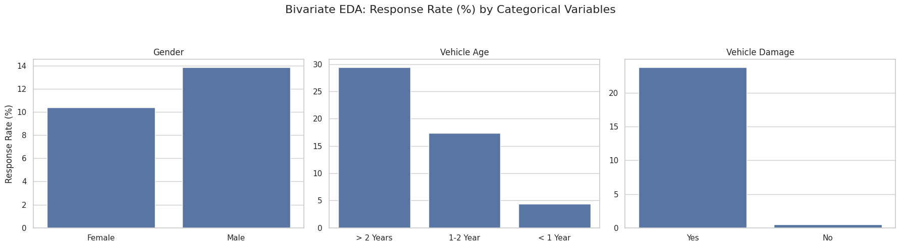
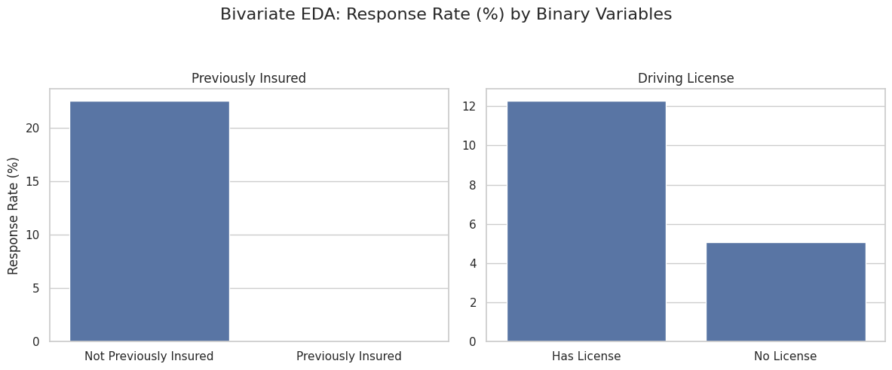
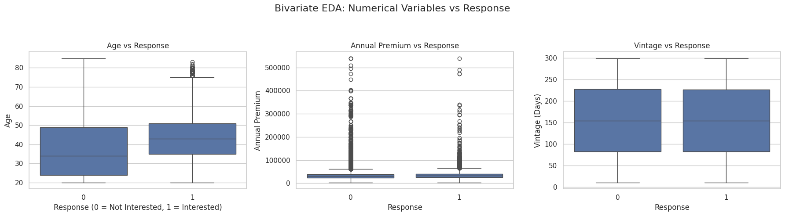
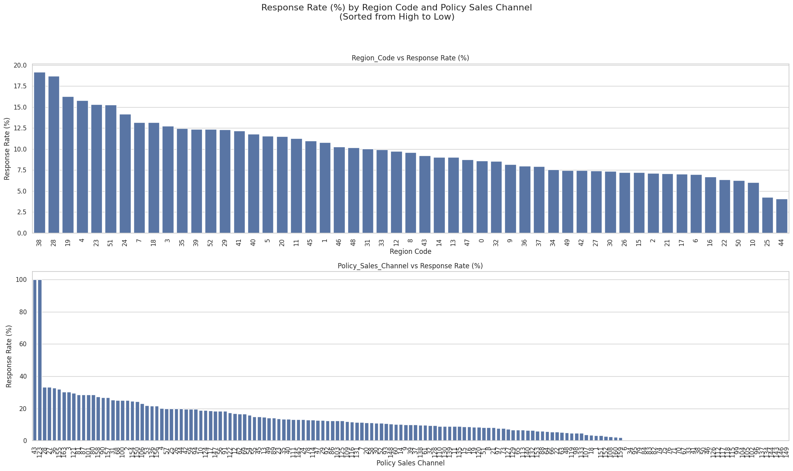

# Health Insurance Cross Sell Prediction

## ภาพรวมโครงการ (Project Overview)
โครงการนี้มีวัตถุประสงค์เพื่อดำเนินการวิเคราะห์ข้อมูลเชิงสำรวจ (Exploratory Data Analysis: EDA) บนชุดข้อมูลลูกค้าประกันภัย เพื่อทำความเข้าใจลักษณะการกระจายของข้อมูล ความสัมพันธ์ระหว่างตัวแปร และปัจจัยที่ส่งผลต่อการตอบสนองของลูกค้า (Response)
โดยผลลัพธ์จากการทำ EDA จะถูกนำไปใช้ในการคัดเลือกตัวแปร (Feature Selection) และออกแบบตัวแปรใหม่ (Feature Engineering) เพื่อเตรียมความพร้อมสำหรับการพัฒนาแบบจำลองการเรียนรู้ของเครื่องประเภท Ensemble ซึ่งมุ่งเน้นการเพิ่มประสิทธิภาพ
ในการพยากรณ์และลดความเอนเอียงของโมเดล

---

## นิยามปัญหา (Problem Statement)
แม้ว่าชุดข้อมูลจะมีตัวแปรที่หลากหลายซึ่งครอบคลุมลักษณะของลูกค้าและยานพาหนะ แต่ยังขาดความเข้าใจอย่างเป็นระบบเกี่ยวกับความสัมพันธ์ระหว่างตัวแปรอิสระกับตัวแปรเป้าหมาย (`Response`)
ปัญหาที่พบในข้อมูลชุดนี้ ได้แก่:
- ตัวแปรเป้าหมายมีลักษณะไม่สมดุล (Class Imbalance)
- ตัวแปรบางส่วนเป็นข้อมูลเชิงหมวดหมู่ที่ถูกเข้ารหัสเป็นตัวเลข ซึ่งอาจนำไปสู่การตีความที่คลาดเคลื่อน
- ยังไม่สามารถระบุได้อย่างชัดเจนว่าตัวแปรใดมีอิทธิพลต่อการตอบสนองของลูกค้า
- การเลือกตัวแปรแบบสุ่มอาจส่งผลต่อประสิทธิภาพของแบบจำลองในขั้นตอนถัดไป

---

## วัตถุประสงค์ของโครงการ (Objectives)
1. เพื่อสำรวจโครงสร้างและลักษณะการกระจายของข้อมูลในแต่ละตัวแปร
2. เพื่อวิเคราะห์ความสัมพันธ์ระหว่างตัวแปรอิสระกับตัวแปรเป้าหมาย (Response)
3. เพื่อค้นหาตัวแปรที่มีความสำคัญต่อการพยากรณ์
4. เพื่อสนับสนุนการคัดเลือกตัวแปร (Feature Selection) อย่างมีเหตุผลเชิงข้อมูล
5. เพื่อเตรียมชุดข้อมูลสำหรับการสร้างแบบจำลอง Machine Learning ประเภท Ensemble เช่น  
   - Random Forest  
   - Gradient Boosting  
   - XGBoost  

---

## รายละเอียดชุดข้อมูล (Dataset Description)
- ชุดข้อมูลเป็นข้อมูลระดับลูกค้า โดย 1 แถวแทนลูกค้า 1 ราย และแต่ละคอลัมน์แทนคุณลักษณะของลูกค้า
- จำนวนข้อมูล: 381,109 แถว
- จำนวนตัวแปร: 12 ตัวแปร
- Data Sources [www.kaggle.com](https://www.kaggle.com/datasets/anmolkumar/health-insurance-cross-sell-prediction/code)

---

## Data Dictionary
| ชื่อตัวแปร | ประเภทข้อมูล | คำอธิบาย |
|----------|------------|----------|
| `id` | Integer | รหัสประจำตัวลูกค้า (Unique ID) |
| `Gender` | Categorical | เพศของลูกค้า (Male, Female) |
| `Age` | Numeric | อายุของลูกค้า (ปี) |
| `Driving_License` | Binary | สถานะการมีใบขับขี่ (1 = มีใบขับขี่, 0 = ไม่มีใบขับขี่) |
| `Region_Code` | Categorical (Encoded) | รหัสระบุภูมิภาคของลูกค้า (ถูกเข้ารหัส) |
| `Previously_Insured` | Binary | สถานะการเคยมีประกันรถยนต์มาก่อน (1 = เคยมี, 0 = ไม่เคยมี) |
| `Vehicle_Age` | Categorical | อายุของรถยนต์ (< 1 Year, 1-2 Year, > 2 Years) |
| `Vehicle_Damage` | Categorical | ประวัติรถเคยเกิดความเสียหาย (Yes = เคยเกิดความเสียหาย, No = ไม่เคย) |
| `Annual_Premium` | Numeric | จำนวนเงินค่าเบี้ยประกันที่ลูกค้าต้องชำระต่อปี |
| `Policy_Sales_Channel` | Categorical (Encoded) | รหัสช่องทางการขายแบบไม่ระบุตัวตน เช่น ตัวแทนขาย, โทรศัพท์, จดหมาย, พบลูกค้าโดยตรง |
| `Vintage` | Numeric | จำนวนวันตั้งแต่ลูกค้าเริ่มมีความสัมพันธ์กับบริษัท |
| `Response` | Binary (Target) | ตัวแปรเป้าหมาย แสดงความสนใจของลูกค้า (1 = สนใจ / ตอบรับ, 0 = ไม่สนใจ) |

---

## เครื่องมือและไลบรารี (Tools & Libraries)
- **Python**: ภาษาหลักสำหรับการวิเคราะห์ข้อมูลและการสร้างโมเดล
- **Pandas / NumPy**: การจัดการและประมวลผลข้อมูล
- **Matplotlib / Seaborn**: การสร้างกราฟและการแสดงผลข้อมูล
- **Scikit-learn**: เครื่องมือสำหรับ preprocessing, feature selection และ ensemble models
- **XGBoost**: Ensemble learning library สำหรับ Gradient Boosting

---

## Exploratory Data Analysis (EDA)
- ชุดข้อมูลที่ใช้ในการวิเคราะห์ประกอบด้วยข้อมูลลูกค้า 381,109 ราย โดยมีตัวแปรทั้งหมด 12 ตัวแปร 
- ข้อมูลทั้งหมดไม่มีค่า missing values 
- ตัวแปรเป้าหมาย (Response) มี Class Imbalance โดย
  - กลุ่มที่ไม่ตอบรับ (Response = 0) มีสัดส่วน 87.74% 
  - กลุ่มที่ตอบรับ (Response = 1) มีเพียง 12.26%
- ตัวแปรในชุดข้อมูลสามารถแบ่งออกเป็น 3 ประเภทหลัก ได้แก่
  - ตัวแปรเชิงหมวดหมู่ (Categorical Variables) Gender/Vehicle_Age/Vehicle_Damage
  - ตัวแปรแบบไบนารี (Binary Variables) Previously_Insured/Driving_License
  - ตัวแปรเชิงตัวเลข (Numerical Variables) Age/Annual_Premium/Vintage
  - ตัวแปรรหัสเชิงระเบียน (Categorical (Encoded)) Region_Code/Policy_Sales_Channel

---

### กลุ่มที่ 1: Categorical (เชิงคุณลักษณะ) vs Response
จากการวิเคราะห์เชิงสองตัวแปร (Bivariate EDA) โดยเปรียบเทียบตัวแปรเชิงหมวดหมู่ (Categorical Variables) กับตัวแปรเป้าหมาย (Response) ในรูปของ Response Rate (%)
พบว่าตัวแปรแต่ละตัวแสดงระดับความสัมพันธ์กับการตอบสนองของลูกค้าที่แตกต่างกันอย่างชัดเจน ดังนี้

#### 1.1 ผลการวิเคราะห์ตัวแปร Gender 
- ค่า: Male, Female
- ผลวิเคราะห์: แสดงให้เห็นว่าอัตราการตอบรับของลูกค้าเพศชายและเพศหญิงมีความแตกต่างกันไม่มากนัก ซึ่งบ่งชี้ว่าตัวแปรนี้อาจมีอิทธิพลต่อการตอบสนองในระดับจำกัด
และอาจเหมาะสมสำหรับการใช้งานร่วมกับตัวแปรอื่นในรูปแบบของ interaction มากกว่าการใช้เป็นตัวแปรหลักเพียงลำพัง

#### 1.2 ผลการวิเคราะห์ตัวแปร Vehicle_Age 
- ค่า: < 1 Year, 1-2 Year, > 2 Years
- ผลวิเคราะห์: แสดงรูปแบบความสัมพันธ์กับการตอบสนองอย่างชัดเจน โดยกลุ่มลูกค้าที่มีรถยนต์อายุเก่ากว่า (โดยเฉพาะรถที่มีอายุมากกว่า 2 ปี) มีอัตราการตอบรับสูงกว่ากลุ่มรถใหม่อย่างเห็นได้ชัด
สะท้อนให้เห็นถึงแนวโน้มเชิงพฤติกรรมที่ลูกค้าที่ใช้รถมานานอาจมีความสนใจในผลิตภัณฑ์ประกันเพิ่มเติมมากกว่า

#### 1.3 ผลการวิเคราะห์ตัวแปร Vehicle_Damage  
- ค่า: Yes, No
- ผลวิเคราะห์: พบว่าลูกค้าที่มีประวัติรถเคยเกิดความเสียหายมีอัตราการตอบรับสูงกว่ากลุ่มที่ไม่เคยเกิดความเสียหาย ซึ่งสอดคล้องกับตรรกะเชิงธุรกิจ เนื่องจากลูกค้าที่เคยมีประสบการณ์ความเสี่ยงมีแนวโน้มตระหนักถึงความสำคัญของการทำประกันภัยมากกว่า

---

### กลุ่มที่ 2: Binary (เชิงพฤติกรรมลูกค้า) vs Response
จากการวิเคราะห์เชิงสองตัวแปร (Bivariate EDA) โดยพิจารณาความสัมพันธ์ระหว่างตัวแปรแบบไบนารี (Binary Variables) กับตัวแปรเป้าหมาย (Response) ในรูปของ Response Rate (%)
พบว่าตัวแปรในกลุ่มนี้มีความแตกต่างเชิงพฤติกรรมของลูกค้าอย่างชัดเจน ดังนี้

#### 2.1 ผลการวิเคราะห์ตัวแปร Previously_Insured
- ค่า: 0, 1
- ผลวิเคราะห์: แสดงให้เห็นว่า ลูกค้าที่ ไม่เคยมีประกันมาก่อน (Not Previously Insured) มีอัตราการตอบรับสูงกว่ากลุ่มที่ เคยมีประกันแล้ว (Previously Insured) อย่างมีนัยสำคัญ
  โดยกลุ่มที่เคยมีประกันมาก่อนมีอัตราการตอบรับต่ำมากจนเกือบเป็นศูนย์ ซึ่งสอดคล้องกับตรรกะทางธุรกิจ เนื่องจากลูกค้าที่มีประกันอยู่แล้วมักไม่มีความจำเป็นต้องซื้อประกันเพิ่มเติมในช่วงเวลาเดียวกัน

#### 2.2 ผลการวิเคราะห์ตัวแปร Driving_License
- ค่า: 0, 1
- ผลวิเคราะห์: สำหรับตัวแปร Driving License พบว่าลูกค้าที่ มีใบขับขี่ (Has License) มีอัตราการตอบรับสูงกว่ากลุ่มที่ ไม่มีใบขับขี่ (No License) อย่างชัดเจน
  ซึ่งบ่งชี้ว่าความพร้อมในการใช้งานรถยนต์มีความสัมพันธ์กับความสนใจในผลิตภัณฑ์ประกันภัย อย่างไรก็ตาม อัตราการตอบรับโดยรวมของตัวแปรนี้ยังต่ำกว่าตัวแปร Previously Insured แสดงให้เห็นว่าตัวแปรนี้อาจมีอิทธิพลต่อการพยากรณ์ในระดับรอง

---

### กลุ่มที่ 3: Numerical Variables vs Response
จากการวิเคราะห์เชิงสองตัวแปร (Bivariate EDA) โดยพิจารณาความสัมพันธ์ระหว่างตัวแปรเชิงตัวเลข (Numerical Variables) กับตัวแปรเป้าหมาย (Response) ผ่านการเปรียบเทียบการกระจายของข้อมูลด้วย
boxplot พบว่าตัวแปรแต่ละตัวแสดงรูปแบบความสัมพันธ์กับการตอบสนองของลูกค้าที่แตกต่างกัน ดังนี้

#### 3.1 ผลการวิเคราะห์ตัวแปร Age
- ค่า: 20-85
- ผลวิเคราะห์: แสดงให้เห็นว่าลูกค้าที่ตอบรับข้อเสนอประกัน (Response = 1) มีค่ามัธยฐาน (median) ของอายุ สูงกว่ากลุ่มที่ไม่ตอบรับ (Response = 0) อย่างชัดเจน นอกจากนี้การกระจายของอายุในกลุ่มที่ตอบรับยังมีแนวโน้มเลื่อนไปทางช่วงอายุที่มากขึ้น
  สะท้อนให้เห็นว่าลูกค้าที่มีอายุมากกว่าอาจให้ความสำคัญกับการทำประกันเพิ่มเติมมากขึ้น อย่างไรก็ตาม รูปแบบการกระจายยังมีส่วนทับซ้อนกันระหว่างสองกลุ่ม ซึ่งบ่งชี้ว่าอายุเพียงตัวเดียวอาจไม่สามารถแยกกลุ่มลูกค้าได้อย่างสมบูรณ์

#### 3.2 ผลการวิเคราะห์ตัวแปร Annual_Premium
- ค่า: 2630-301762
- ผลวิเคราะห์: พบว่าการกระจายของข้อมูลในทั้งสองกลุ่มมีลักษณะ right-skewed และมีค่าผิดปกติ (outliers) จำนวนมาก ค่า median ของกลุ่มที่ตอบรับและไม่ตอบรับมีความใกล้เคียงกันมาก และไม่แสดงความแตกต่างที่ชัดเจนเท่ากับตัวแปรอื่น
  ผลลัพธ์ดังกล่าวบ่งชี้ว่าค่าเบี้ยประกันรายปีอาจไม่ใช่ปัจจัยหลักในการอธิบายการตอบสนองของลูกค้าในระดับเดี่ยว อย่างไรก็ตาม ตัวแปรนี้ยังอาจมีบทบาทเมื่อถูกนำไปพิจารณาร่วมกับตัวแปรอื่น หรือผ่านการแปลงข้อมูล (เช่น การทำ log transformation) ในขั้นตอนการสร้างแบบจำลอง

#### 3.3 ผลการวิเคราะห์ตัวแปร Vintage
- ค่า: 10-299
- ผลวิเคราะห์: แสดงให้เห็นว่าการกระจายของระยะเวลาความสัมพันธ์ระหว่างลูกค้ากับบริษัทในทั้งสองกลุ่มมีลักษณะค่อนข้างใกล้เคียงกัน ค่า median และช่วงการกระจาย (interquartile range) ของกลุ่มที่ตอบรับและไม่ตอบรับไม่แตกต่างกันอย่างเด่นชัด
ผลลัพธ์นี้ชี้ให้เห็นว่าตัวแปร Vintage อาจมีอิทธิพลจำกัดต่อการตอบสนองของลูกค้าเมื่อพิจารณาเพียงลำพัง แต่ยังอาจมีประโยชน์ในเชิง interaction กับตัวแปรอื่น เช่น อายุหรือประวัติการถือประกัน

---

### กลุ่มที่ 4: Categorical (Encoded) vs Response
อัตราการตอบสนอง (Response Rate %) ของลูกค้า โดยจัดเรียงจาก ค่าสูงไปต่ำ สำหรับตัวแปรที่มีลักษณะเป็น high-cardinality categorical variables ได้แก่ Region_Code และ Policy_Sales_Channel ซึ่งมีจำนวนกลุ่มย่อยจำนวนมาก 
การแสดงผลในลักษณะนี้มีวัตถุประสงค์เพื่อให้เห็นภาพรวมของความแตกต่างเชิงรูปแบบ (pattern) มากกว่าการตีความเชิงลำดับหรือเชิงสาเหตุ

#### 4.1 ผลการวิเคราะห์ตัวแปร Region_Code
- ค่า: encoded categorical
- ผลวิเคราะห์: พบว่าอัตราการตอบสนองของลูกค้าแตกต่างกันอย่างมีนัยสำคัญระหว่างแต่ละ Region_Code โดยค่า Response Rate สูงสุดอยู่ที่ประมาณ เกือบ 20% และค่อย ๆ ลดลงเป็นลำดับจนถึงช่วงต่ำสุดประมาณ 3–4% สะท้อนให้เห็นถึงความแตกต่างเชิงภูมิภาค
  ในการตอบสนองของลูกค้า อย่างไรก็ตาม เนื่องจาก Region_Code เป็นรหัสเชิงระเบียน (encoded categorical) ที่ไม่มีความหมายเชิงลำดับโดยตรง การจัดเรียงจากมากไปน้อยในที่นี้มีวัตถุประสงค์เพื่อ สำรวจรูปแบบ (exploratory inspection) เท่านั้น
  ไม่ควรถูกตีความว่าเป็นการจัดอันดับความสำคัญหรือประสิทธิภาพของแต่ละภูมิภาคในเชิงเชิงสาเหตุ

#### 4.2 ผลการวิเคราะห์ตัวแปร Policy_Sales_Channel
- ค่า: encoded categorical
- ผลวิเคราะห์: พบว่าอัตราการตอบสนองของลูกค้าเมื่อพิจารณาตาม Policy_Sales_Channel ซึ่งพบรูปแบบที่แตกต่างจาก Region_Code อย่างชัดเจน โดยมี บางช่องทาง (channel) ที่แสดง Response Rate สูงมากเมื่อเทียบกับช่องทางอื่น ๆ
  และหลังจากนั้นค่า Response Rate จะลดลงอย่างรวดเร็วและต่อเนื่อง ลักษณะดังกล่าวสะท้อนให้เห็นถึง ความไม่สมดุลของประสิทธิภาพช่องทางการขาย โดยช่องทางเพียงไม่กี่ช่องทางสามารถสร้างอัตราการตอบรับได้สูง ขณะที่ช่องทางส่วนใหญ่มีอัตราการตอบรับ
  อยู่ในระดับค่อนข้างต่ำถึงต่ำมาก รูปแบบนี้อาจเกิดจากความแตกต่างด้านลักษณะลูกค้า วิธีการติดต่อ หรือบริบทการขายในแต่ละช่องทาง อย่างไรก็ตาม เช่นเดียวกับ Region_Code ตัวแปร Policy_Sales_Channel เป็นตัวแปรเชิงหมวดหมู่ที่มีจำนวนกลุ่มสูง
  และไม่สามารถตีความเชิงลำดับหรือเชิงกลยุทธ์ได้จากกราฟนี้เพียงอย่างเดียว การวิเคราะห์ดังกล่าวจึงเหมาะสมสำหรับการใช้เป็น supporting evidence ในการตัดสินใจด้าน Feature Engineering เช่น การทำ target encoding หรือการปล่อยให้แบบจำลองเชิง
  Ensemble เรียนรู้รูปแบบจากข้อมูลโดยตรง

---

## Overall EDA Insights and Feature Selection Prioritization
จากการวิเคราะห์ข้อมูลเชิงสำรวจ (Exploratory Data Analysis: EDA) โดยพิจารณาทั้งการกระจายของข้อมูล (Univariate Analysis) และความสัมพันธ์กับตัวแปรเป้าหมาย (Bivariate Analysis) สามารถสรุปประเด็นสำคัญและจัดลำดับความสำคัญของ
ตัวแปรสำหรับการคัดเลือกคุณลักษณะ (Feature Selection) ได้ดังต่อไปนี้

### 1. High-Level Insights from EDA
#### 1.1 Target Variable (Response)
ตัวแปรเป้าหมาย (Response) มีลักษณะ Class Imbalance อย่างชัดเจน โดยกลุ่มลูกค้าที่ไม่ตอบรับมีสัดส่วนสูงกว่ากลุ่มที่ตอบรับอย่างมาก สะท้อนบริบททางธุรกิจจริงของการเสนอขายประกัน และสนับสนุนการเลือกใช้ตัวชี้วัดประเมินผลที่เหมาะสม (เช่น Recall, AUC)
และแบบจำลองประเภท Ensemble ในขั้นตอนถัดไป

#### 1.2 Categorical Variables
Vehicle_Age และ Vehicle_Damage แสดงความสัมพันธ์กับ Response อย่างชัดเจน โดยรถที่มีอายุเก่ากว่าและรถที่เคยเกิดความเสียหาย มีอัตราการตอบรับสูงกว่ากลุ่มอื่น ส่วน Gender แสดงความแตกต่างของ Response Rate ในระดับจำกัด 
แม้มี signal บางส่วน แต่ไม่เด่นชัดเมื่อพิจารณาเพียงลำพัง
**Insight หลัก:** ตัวแปรเชิงคุณลักษณะของยานพาหนะมีอิทธิพลต่อการตัดสินใจของลูกค้ามากกว่าตัวแปรประชากรศาสตร์พื้นฐาน

#### 1.3 Binary Variables
Previously_Insured เป็นตัวแปรที่มี signal ชัดเจนที่สุดในทั้งชุดข้อมูล โดยลูกค้าที่ไม่เคยมีประกันมีอัตราการตอบรับสูงกว่ากลุ่มที่เคยมีประกันอย่างมาก ส่วน Driving_License แสดงแนวโน้มเชิงบวกต่อ Response แต่มีพลังในการจำแนกต่ำกว่า Previously_Insured
**Insight หลัก:** ตัวแปรเชิงพฤติกรรมของลูกค้า (behavioral variables) โดยเฉพาะประวัติการถือประกัน มีอิทธิพลสูงต่อการตอบสนอง

#### 1.4 Numerical Variables
Age แสดงการเลื่อนของ distribution อย่างเห็นได้ชัด โดยกลุ่มที่ตอบรับมีอายุเฉลี่ยสูงกว่า ส่วน Annual_Premium และ Vintage ไม่แสดงความแตกต่างที่ชัดเจนระหว่าง Response=0 และ Response=1
**Insight หลัก:** Numerical variables มีบทบาทรอง และเหมาะสำหรับใช้ร่วมกับตัวแปรอื่นในโมเดล มากกว่าการใช้เป็นตัวแปรเดี่ยว

#### 1.5 High-Cardinality Categorical Variables
Region_Code และ Policy_Sales_Channel แสดงความแปรผันของ Response Rate อย่างชัดเจนเมื่อเรียงจากมากไปน้อย รูปแบบที่พบมีลักษณะ heterogeneous และไม่สม่ำเสมอ ไม่ควรตีความเชิงลำดับหรือเชิงสาเหตุจากตัวแปรเหล่านี้โดยตรง
**Insight หลัก:** ตัวแปรกลุ่มนี้เหมาะสำหรับใช้เป็น supporting features หรือปล่อยให้โมเดลประเภท Ensemble เรียนรู้รูปแบบด้วยตนเอง

### 2. Feature Selection Prioritization
จาก Insight ทั้งหมด สามารถจัดลำดับความสำคัญของตัวแปรสำหรับการคัดเลือกคุณลักษณะได้ดังนี้
#### Tier 1: High Priority Features (Strong Signal)
ตัวแปรที่มีความสัมพันธ์กับ Response อย่างชัดเจน และควรถูกใช้ในโมเดลเป็นลำดับแรก ได้แก่
- Previously_Insured
- Vehicle_Age
- Vehicle_Damage
#### Tier 2: Medium Priority Features (Moderate / Supporting Signal)
ตัวแปรที่มี signal ในระดับปานกลาง หรือทำงานได้ดีเมื่อใช้ร่วมกับตัวแปรอื่น
- Age
- Driving_License
- Gender
#### Tier 3: Supporting / Advanced Features
ตัวแปรที่ไม่เหมาะสำหรับการตีความเชิงเดี่ยว แต่มีคุณค่าในเชิงโครงสร้างข้อมูล
- Region_Code
- Policy_Sales_Channel

#### Lower Priority / Cautious Use
ตัวแปรที่แสดง signal ต่ำเมื่อพิจารณาเดี่ยว แต่สามารถเก็บไว้เพื่อให้โมเดลเรียนรู้ interaction
- Annual_Premium
- Vintage

--- 

